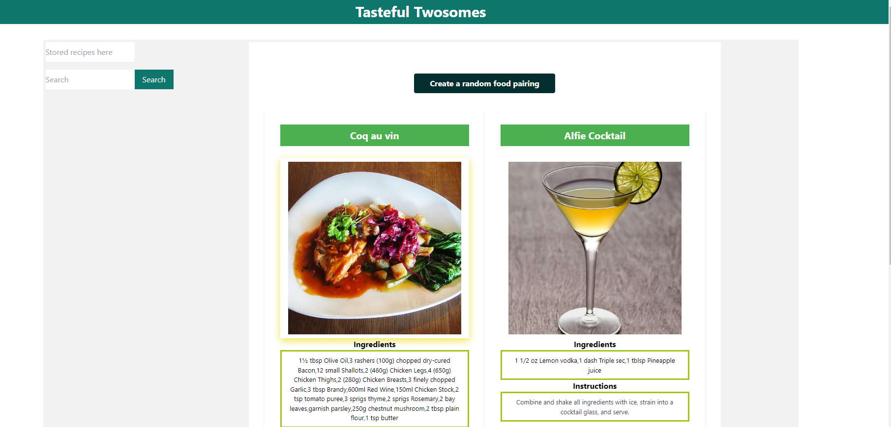

# Tasteful-Twosomes
This application is designed to randomly generate a meal recipe and drink recipe pairing. 

## Description
* Once the "create a random food pairing" button is clicked, the application generates a random meal and cocktail recipe.
* The recipe and instructions are populated below the image of each meal and cocktail.
* Select the "save to favorites" button to keep each of your favorite pairings saved. 

## Screenshot of page

## Link to page

## Installation
N/A

## Usage
* Click the random food pairing button to generate the meal and cocktail recipes. You will see recipe and instructions below the image of the meal and cocktail. If you wish, you may save your favorite pairings to the localStorage. 

## Credits
https://www.thecocktaildb.com/api.php

https://www.themealdb.com/api.php

https://tailwindcss.com/

https://developer.mozilla.org/en-US/

## License
Please refer to the License in the repository. 
